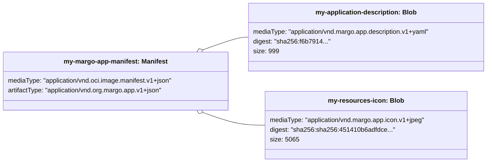

# Application Package

The Application Package, which is used to [distribute an application](../../overview/applications.md) to be deployed as [workloads](../../personas-and-definitions/technical-lexicon.md#workload) on edge devices, comprises the following elements:
 
- The **Application Description**: a YAML document with the element `kind` defined as `ApplicationDescription`, which is stored in a file (for example named `margo.yaml`) and contains information about the application's [metadata](../../specification/applications/application-description.md#metadata-attributes) (e.g., name, version, author, etc.), the application [components](../../personas-and-definitions/technical-lexicon.md#component) (e.g.,  Helm charts, Compose Archive), which are defined in [deployment configurations](../../specification/applications/application-description.md#deploymentprofile-attributes), and [configurable application parameters](../../specification/applications/application-description.md#defining-configurable-application-parameters).  There is only one YAML file in the package root of kind `ApplicationDescription`.
- The **resources**, which are additional files associated with the application (human-readable description, icon, release notes, or license file) that may be used to provide more information about the application (e.g., in a UI such as an [application catalog](../../personas-and-definitions/technical-lexicon.md#application-catalog) of a [WFM](../../personas-and-definitions/technical-lexicon.md#workload-fleet-manager)).

The Application Package is distributed via an [Application Registry](./application-registry.md) and is bundled within a **repository** according to the [OCI distribution specification](https://github.com/opencontainers/distribution-spec/blob/v1.1.0/spec.md).
All files (i.e., Application Description and resource files) belonging to the Application Package are referenced as *layers* (the equivalent term **blobs** is nowadays preferred and will be used in the rest of this document) by a **manifest** inside the repository.
The blob of the Application Description file is marked with a **mediaType** value as `application/vnd.margo.app.description.v1+yaml`.
The blobs of resource files are marked with an according **mediaType** (see list [here](../../specification/applications/application-registry.md#margo-specific-media-types)), e.g., an icon in jpeg format is marked with the mediaTye `application/vnd.margo.app.icon.v1+jpeg`. 
This is illustrated in the figure below and formally defined [here](../../specification/applications/application-registry.md).

An application aggregates one or more [components](../../personas-and-definitions/technical-lexicon.md#component). Therefore, the [deployment profiles](../../specification/applications/application-description.md#deploymentprofile-attributes) specified in the [Application Description](../../specification/applications/application-description.md) can be defined as Helm Chart components AND/OR [Compose Archive](../../personas-and-definitions/technical-lexicon.md#compose-archive) components.

Each component links to one or more [OCI Container Images](https://github.com/opencontainers/image-spec).
The components  referenced in the [Application Description](../../specification/applications/application-description.md) are stored in a [Component Registry](../../personas-and-definitions/technical-lexicon.md#component-registry), and the linked container images are provided via a [Container Image Registry](../../personas-and-definitions/technical-lexicon.md#container-image-registry).
Registries can be remote (i.e., Internet-accessible) or [local](../../concepts/applications/local-registries.md) (i.e., accessible within a local network infrastructure of the devices). 

 The components are being deployed as workloads on the edge devices:

- To target devices, which deploy workloads using Kubernetes, components need to be defined as Helm charts using [Helm (version 3)](https://helm.sh/docs/topics/charts/).
- To target devices, which deploy workloads using [Compose](https://www.compose-spec.io/), components need to be packaged as [Compose Archives](../../personas-and-definitions/technical-lexicon.md#compose-archive), i.e., a tarball file containing the `compose.yaml` file and any additional artifacts referenced by the Compose file (e.g., configuration files, environment variable files, etc.). Margo recommends to digitally sign this package and to specify the location of the public key in the `ApplicationDescription` (see `keyLocation` [here](../../specification/applications/application-description.md#componentproperties-attributes)). When digitally signing the package PGP encryption MUST be used.

If either one cannot be implemented it MAY be omitted but Margo RECOMMENDS defining [deployment profiles](../../specification/applications/application-description.md#deploymentprofile-attributes) as both Helm chart **AND** Compose components to strengthen interoperability and applicability.

> **Note**
> A device running the application will only install the application using either the Compose Archives or the Helm Charts, but not both.

Margo will provide more detailed discussion and specification on the following points:

> **Investigation Needed**: Question: do we need to specify the location of a SHA256 hash for the Compose Archive also (similar to the PGP key) in the ApplicationDescription? 
> We will also discuss how we should handle secure container registries that require a username and password.
>
> **Investigation Needed**: We need to determine what impact, if any, using 3rd party helm charts has on being Margo compliant.
>
> **Investigation Needed**: Missing in the current specification are ways to define dependencies (e.g., application dependencies) as well as required infrastructure services such as storage, message queues/bus, reverse proxy, or authentication/authorization/accounting.

## Relevant Links
Please follow the subsequent link to view the technical reference of the `ApplicationDescription` format:

- [Application Description](../../specification/applications/application-description.md)