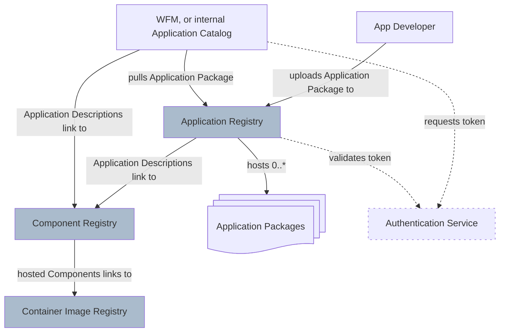

# Application Registry

The Margo specification differentiates 3 kinds of registries: *Application Registries*, *Component Registries*, and *Container Image Registries*.

1. An **Application Registry** hosts Application Packages that define through their [Application Description](../../specification/applications/application-description.md) the application as one or multiple [Components](../../personas-and-definitions/technical-lexicon.md#component).
2. A **Component Registry** hosts the [Components](../../personas-and-definitions/technical-lexicon.md#component) (which are deployable as *workloads*) and are provided  as **Helm Charts** or **Compose Archives**.
3. A **Container Image Registry** hosts container images referenced by those Components.

Out of these 3 registries, **only the Application Registry interface is in scope** of the Margo specification and its API definition can be found [here](../../specification/applications/application-registry.md).  

The diagram below illustrates these functionalities and relationships of registries within Margo.

As shown in the figure above, an `Application Developer` uploads an [Application Package](application-package) to an Application Registry. From there, it is available to a `Workload Fleet Manager` (WFM).
The WFM acts as a client to pull an [Application Package](application-package) from the Application Registry. It would then list this Application Package on its UI (e.g., an internal `Application Catalog`) to enable the usage on its managed devices.

> Note: The figure above shows an `Authentication Service` that manages access control for the Application Registry. This service and interactions with it are not yet formally defined by Margo and needs to be further discussed in the future. The idea here is that the WFM requests a token from the Authentication Service to include in requests to the Application Registry. The received token is then validated by the Application Registry through interaction with the Authentication Service.

The Application Registry's API is compliant with the [OCI Registry API (v1.1.0)](https://github.com/opencontainers/distribution-spec/blob/v1.1.0/spec.md).
A hosted Application Package is provided by listing its parts as blobs in an [image manifests](https://github.com/opencontainers/image-spec/blob/v1.0.1/manifest.md) that can be requested through the API.

## Relevant Links
* The technical reference of the Application Registry API is defined [here](../../specification/applications/application-registry.md).
