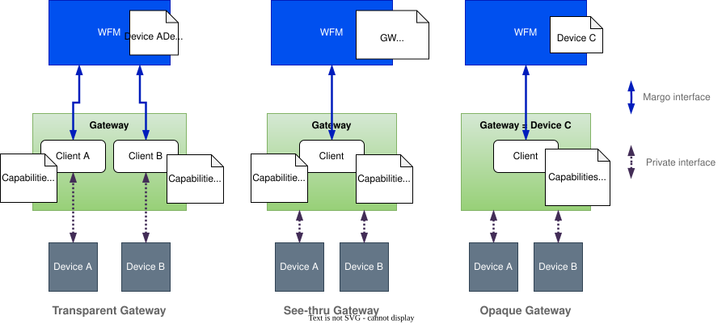

# Gateways

A Margo gateway service is a service that allows one or several non-Margo devices to connect to and be managed by a Margo Workload Fleet Manager (WFM). The gateway service is responsible for translating the communication between the non-Margo devices and the WFM, allowing the non-Margo devices to be managed as Margo devices within the ecosystem.

A Margo gateway service could run on a server, within a device, or on a dedicated device. The service is the Margo concept in each case; hardware dedicated to running it is commonly called a gateway device, but that describes where the service runs rather than a distinct kind of Margo component.

Gateway services determine how downstream devices appear to the WFM as Target Compute, and can be divided into 3 types:

* **Transparent gateway services** are not visible by the WFM. They provide a Margo client for each downstream device they connect, so each device appears to the WFM as its own Target Compute surface.
* **See-thru gateway services** are visible to the WFM, they act on behalf of one or more downstream devices and each device is visible to the WFM. They host a single Margo client for all the downstream devices they connect and present each device as a separate Target Compute surface with its own capabilities.
* **Opaque gateway services** hide the downstream devices they connect to the WFM, presenting a single Target Compute surface with the combined capabilities of all the downstream devices they connect.

In every case the WFM deploys workloads to Target Compute, not to hardware directly, so a Target Compute surface does not necessarily map one to one onto a physical device.

