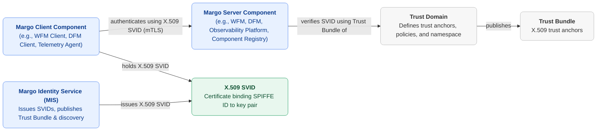

# Identity and Trust

Margo components need a way to prove who they are to one another. A Workload Fleet Manager has to know that a request really comes from a device it manages; a device has to know it is talking to the WFM its operator intended, not an impostor. The **Margo Identity and Authorization Framework (MIAF)** provides that foundation: a common way for Margo components to hold verifiable identities and authenticate to each other.

## Why identity lives at the Trust Domain level

A single industrial deployment often mixes hardware and software from several vendors: devices from different suppliers and applications from others, all managed through a Workload Fleet Manager. If each vendor's components defined their own identities and distributed their own trust anchors, nothing would recognize anything issued elsewhere, and every pairing of components would need its own bespoke trust setup.

MIAF avoids that by lifting identity to the level of a **Trust Domain**: a governed boundary within which identities are issued and mutually recognized. Every component in the domain validates identities against the same published trust material, so a device and a WFM from different vendors can recognize each other without a private arrangement between the two suppliers.

MIAF builds on [SPIFFE](https://spiffe.io/), an open cloud-native identity standard, rather than inventing Margo-specific credentials. This keeps Margo aligned with widely implemented tooling.

## The moving parts

MIAF has four elements that work together:

- **Trust Domain**: the security boundary. It defines the trust anchors, the identity namespace, and the policies for the components within it.
- **Margo Identity Service (MIS)**: the authority that issues identities and publishes trust material for the domain. It is a *role*, not a specific product; a certificate authority, a SPIFFE service such as SPIRE, or an operator's own provisioning workflow can all fill it.
- **Margo components**: the WFMs, device clients, and infrastructure services that hold an identity. Each acts as a holder when it authenticates and as a verifier when it checks a peer.
- **Trust Bundle**: the set of trust anchors the domain publishes. A verifier validates a peer's identity against it.

An identity is expressed as a **SPIFFE ID**, a URI that names a component within its Trust Domain, and is carried by an **X.509-SVID**, an X.509 certificate with that SPIFFE ID embedded in it. Components authenticate to each other with mutual TLS, each presenting its SVID and validating the peer's against the Trust Bundle. Authorization then happens locally: each component decides what a verified identity is allowed to do. There is no central authorization server in the path.

## Fitting the MIS to a deployment

Because the MIS is a role rather than a product, an operator can fulfil it in whatever way suits their environment, for example:

| Pattern | How it works | Where it fits |
| :--- | :---------- | :--------------- |
| **Self-signed root CA** | A certificate authority acts as its own root and issues identities directly. | Self-contained or air-gapped sites. |
| **Intermediate CA under enterprise PKI** | A certificate authority issues identities that chain up to an existing corporate root. | Enterprises with established PKI. |
| **SPIFFE-conformant identity service** | A service such as SPIRE issues identities, configured with Margo's conventions. | Cloud-native or service-mesh environments. |

## Room to grow

Because MIAF is a general framework built on the open SPIFFE standard, the same identity model is not limited to the device-to-WFM connection it secures today. The nearest step is Margo's own future interfaces authenticating the same way: basing a device's interaction with a [Device Fleet Manager](../../personas-and-definitions/technical-lexicon.md#device-fleet-manager) on MIAF is already envisioned, and it would work like the device-to-WFM connection does today, with each side presenting its SVID.

The same foundation also reaches new kinds of participant. Giving a workload a verifiable identity is what SPIFFE was built for, and it extends to autonomous and agentic AI workloads that run at the edge and need to authenticate to services, or to each other.

## Where to go next

- The normative rules are in the [Margo Identity and Authorization Framework](../../specification/identity/identity-framework.md).
- How WFMs and device clients are named and recognized is in the [WFM Identity Profile](../../specification/identity/wfm-identity-profile.md).
- How a device client establishes trust in practice is described in [Device Client Onboarding](../workload-fleet-managers/device-client-onboarding.md).
