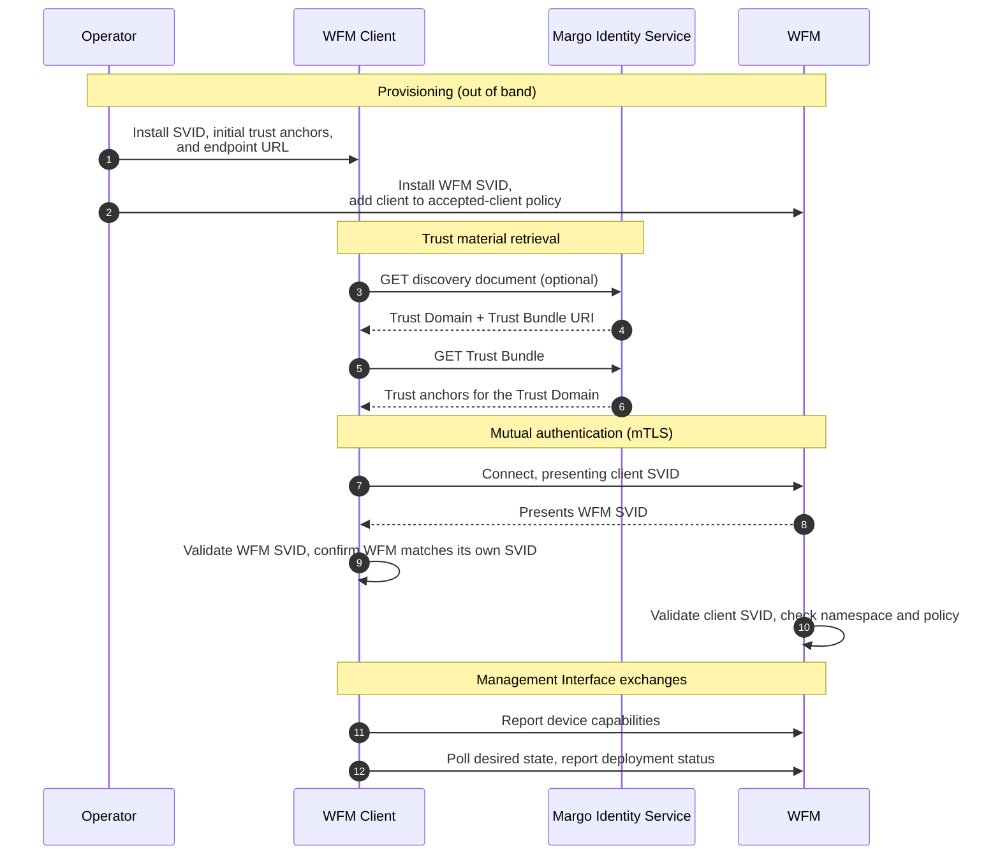

# WFM Client Onboarding

To enable workload management, a device's client establishes trust and a managing relationship with the End User's selected Workload Fleet Manager. This supports late binding, a critical Margo non-functional requirement that lets a device bind to any Margo-compatible Workload Fleet Manager.

Onboarding covers three core functions:

- establishing mutual trust between the device's client and the WFM;
- giving the WFM Client a verifiable identity the WFM recognizes; and
- reporting device capabilities so the WFM can make workload placement decisions.

## Identity and trust

Identity for the device's client comes from the [Margo Identity and Authorization Framework (MIAF)](../../specification/identity/identity-framework.md). Rather than a trust anchor and an identifier that live only at one WFM, MIAF issues identities at the level of a [Trust Domain](../../personas-and-definitions/technical-lexicon.md#trust-domain), where they are recognized across vendors.

Each WFM Client holds an [X.509-SVID](../../personas-and-definitions/technical-lexicon.md#svid) naming the client within the Trust Domain, under the WFM that issues it. The WFM holds its own SVID naming the WFM. An operator provisions both before the client first connects, following the [WFM Identity Profile](../../specification/identity/wfm-identity-profile.md). There is no in-band request in which a device submits a certificate and receives an assigned identifier; the identity is established out of band, through the operator's provisioning channel.

## Establishing trust

Trust between the WFM Client and the WFM is **mutual**, carried at the transport layer by mTLS. Each side presents its SVID and validates the other's against the Trust Domain's [Trust Bundle](../../personas-and-definitions/technical-lexicon.md#trust-bundle).

Before it can validate anything, the client needs the Trust Bundle. An operator can deliver it out of band through the provisioning channel, or the client can retrieve it over HTTPS. Because an HTTPS retrieval predates any MIAF-issued trust, the client authenticates that connection using an initial trust mechanism set up out of band: a configured set of trust anchors, or operator-provisioned certificate pins. Once the client holds the bundle, it is the authoritative source for validating identities within the Trust Domain.

When the client connects to the WFM:

- it validates the WFM's SVID against the Trust Bundle and confirms the WFM is the one named in its own SVID, so it does not connect to the wrong WFM; and
- the WFM validates the client's SVID against the Trust Bundle and confirms the client belongs to its own namespace.

Belonging to the namespace is not the same as permission to use the API. A valid SVID tells the WFM the client was issued for it, but the WFM serves a client only once its operator has added that client to an **accepted-client policy**. This policy is where the operator decides which clients a WFM manages, and removing a client from it is how the operator later ends the relationship.

mTLS is used deliberately here: it authenticates both parties at the transport layer and removes the need for the WFM Client to sign each request at the application layer. In topologies where a TLS-offloading reverse proxy terminates the connection, the proxy validates the client's SVID and forwards the authenticated identity to the WFM backend over an operator-trusted boundary.

## Capability reporting

Once trust is established, the device's client reports its capabilities to the WFM using the [Device Capabilities API](../../specification/margo-management-interface/device-capabilities.md). This is the first exchange after the client connects, and it gives the WFM the information it needs to pair workloads with compatible devices.

## The flow, end to end

## Relevant Links

Please follow the subsequent links to view more technical information on the concepts described above:

- [Margo Identity and Authorization Framework](../../specification/identity/identity-framework.md)
- [WFM Identity Profile](../../specification/identity/wfm-identity-profile.md)
- [Trust Bundle and Discovery Endpoints](../../specification/identity/trust-bundle-and-discovery.md)
- [Identity Lifecycle and Operator Playbooks](../../specification/identity/identity-lifecycle.md)
- [API Requirements and Security](../../specification/margo-management-interface/api-requirements-and-security.md)
- [Device Capabilities API](../../specification/margo-management-interface/device-capabilities.md)
