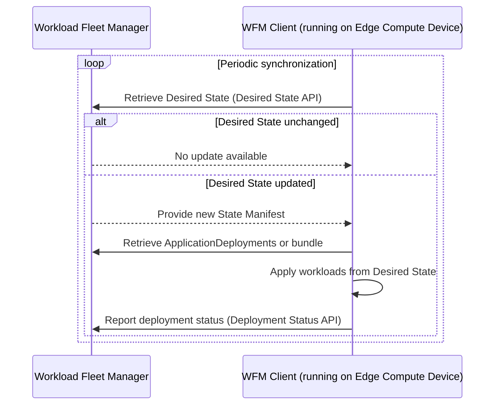

# Workload Deployment

This page describes how Margo manages the deployment and reconciliation of workloads on Edge Compute Devices.

Workload deployment in Margo is based on a declarative Desired State model.
A Workload Fleet Manager (WFM) defines the desired workloads for each Edge Compute Device, including what should run, how each workload should be configured, and the parameters needed for deployment and lifecycle management.
Each device runs a Workload Fleet Management Client (WFM Client) that retrieves and applies this Desired State, while reporting progress and results back to the WFM.
This model provides a consistent and observable way to manage workloads across distributed environments.

## How it works

The Workload Fleet Manager coordinates workloads across Edge Compute Devices.
Operators use the WFM to define workloads, update deployments, and view rollout progress across devices.
The WFM Client continuously reconciles the Desired State provided by the WFM with the workloads actually running on the device.

The WFM and WFM Clients communicate through two key interfaces:

- The [Desired State API](../../specification/margo-management-interface/desired-state.md), which distributes workload definitions to devices
- The [Deployment Status API](../../specification/margo-management-interface/deployment-status.md), which collects deployment updates from devices

Together, these interfaces establish a feedback loop between the centralized manager and the distributed devices, ensuring workload consistency and visibility at scale.

## Desired State

The Desired State defines the workloads that should run on each Edge Compute Device and the details of how they are deployed.
It is represented by a [State Manifest](../../specification/margo-management-interface/desired-state.md#endpoints-state-manifest) that lists all workloads assigned to a device.
The WFM exposes this manifest through the Desired State API.

Each workload is defined by an [ApplicationDeployment](../../specification/margo-management-interface/desired-state.md#applicationdeployment-yaml-definition), which describes:

- The Components that make up the workload, such as Helm charts or Compose-based container bundles
- Configuration parameters and deployment profiles that control workload behavior
- Target information identifying which devices or groups of devices the deployment applies to

The WFM can provide ApplicationDeployments in two formats:

- Individual YAML files, allowing incremental synchronization
- A bundle archive that contains multiple ApplicationDeployments for bulk distribution

All files retrieved as part of the Desired State—manifests, ApplicationDeployment YAMLs, and bundle archives—are treated as immutable artifacts.
Each artifact is referenced by a SHA-256 digest. The WFM Client validates these digests before applying updates to ensure authenticity and consistency.

## Reconciliation process

Each WFM Client maintains the Desired State on its Edge Compute Device by running a continuous reconciliation loop.

1. **Retrieve the manifest:**
   The WFM Client periodically checks the WFM for updates to its State Manifest.
   When a new manifest version is available, the client initiates synchronization.

2. **Retrieve artifacts:**
   The WFM Client downloads the referenced ApplicationDeployment YAMLs or bundle archive.

3. **Verify integrity:**
   The WFM Client verifies that each artifact matches the digest declared in the manifest.
   If verification fails, the update is halted and the current workloads remain unchanged.

4. **Apply the Desired State:**
   The WFM Client compares the current workloads with those defined in the Desired State:

      - Adds or updates workloads that have changed
      - Removes workloads that are no longer listed
      - Keeps workloads that remain valid and current

5. **Report status:**
   As the synchronization proceeds, the WFM Client reports its deployment status to the WFM through the Deployment Status API.

This continuous process allows the WFM to maintain awareness of workload rollout progress and ensures devices converge toward the Desired State.

## Deployment status

The Deployment Status API provides feedback from devices to the Workload Fleet Manager.
The WFM Client reports progress, success, or failure during installation, update, and removal operations.
This feedback allows the WFM to present an aggregated view of deployment health and state across the managed fleet.

A deployment status report includes:

- The identifier of the ApplicationDeployment
- The current deployment state, which may be:

    - Pending - the Desired State has been received but not yet applied
    - Installing - the workload is being deployed
    - Installed - the workload has been successfully applied
    - Removing or Removed - the workload is being or has been uninstalled
    - Failed - an error occurred during deployment

- Optional component-level progress information
- Error codes and messages, when applicable

This information enables real-time monitoring and supports troubleshooting and auditing of workload operations.

## Sequence diagram

