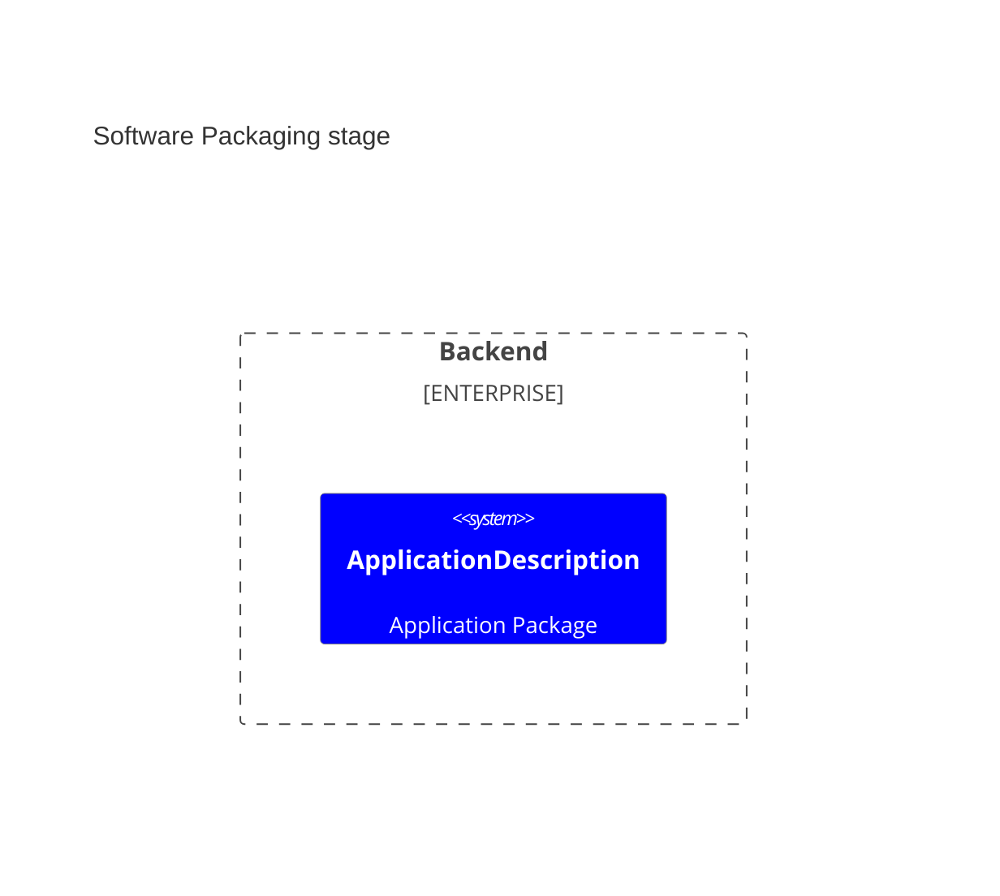
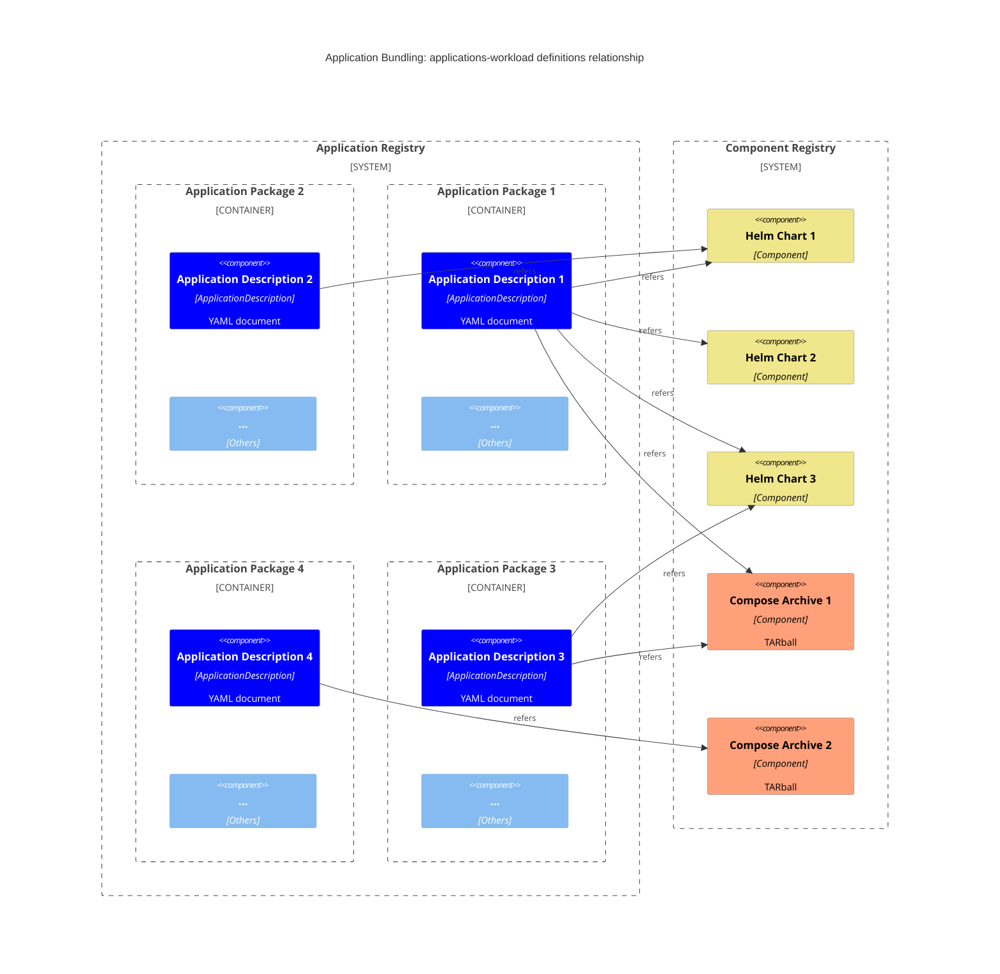
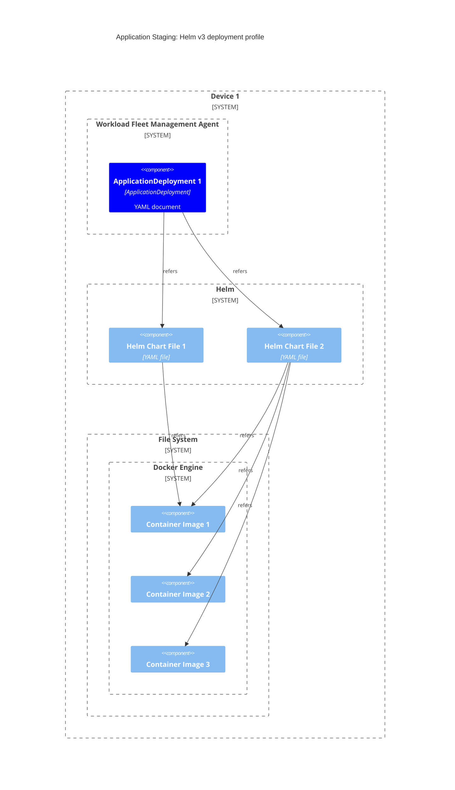
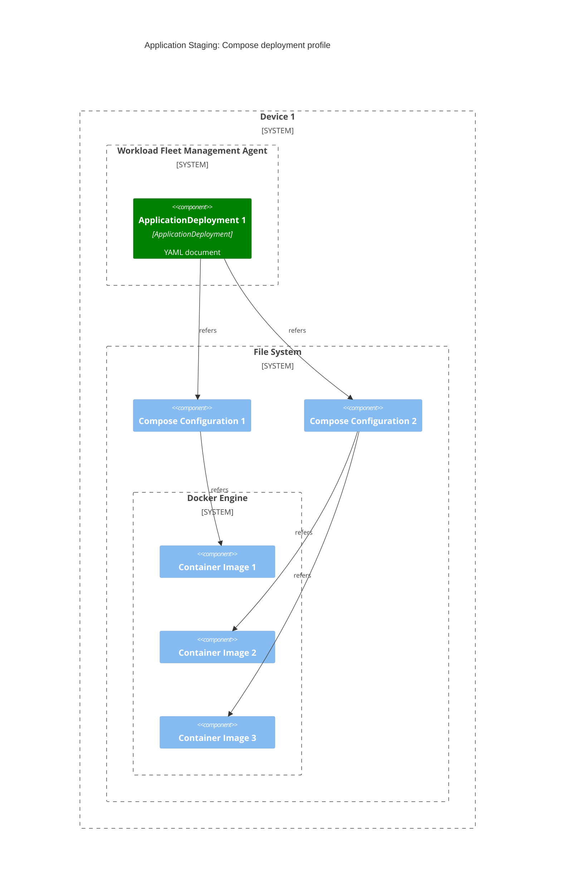
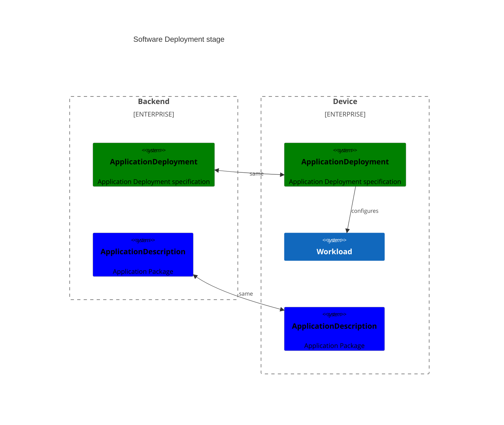
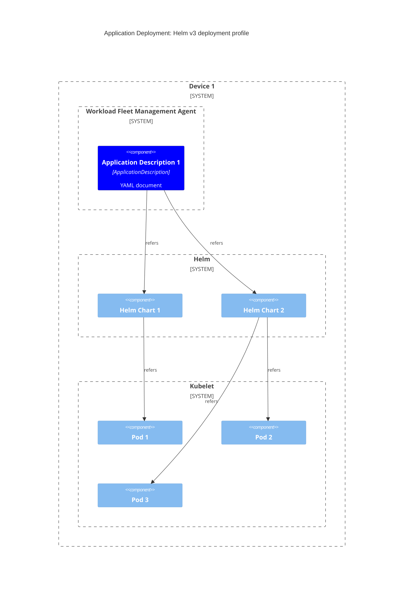
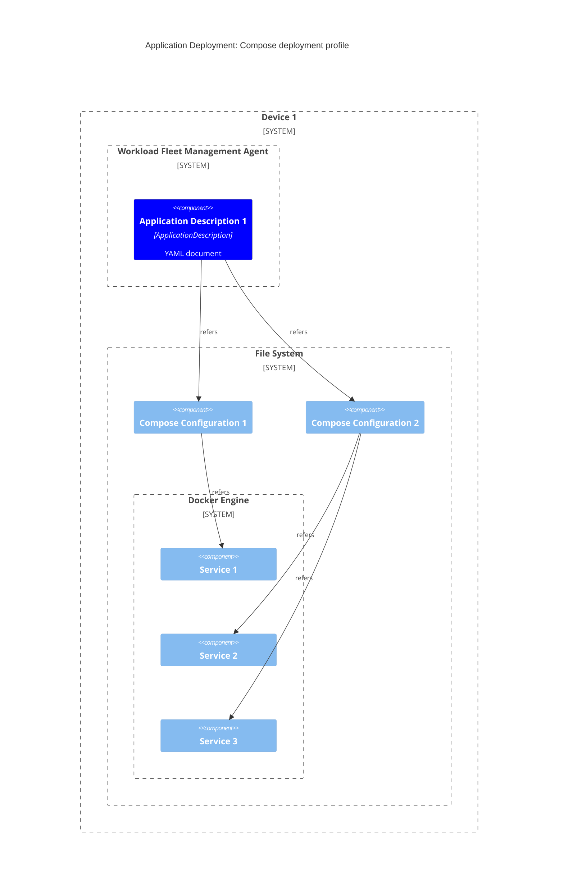

# Software Composition

Applications can be found in completely different stages:

1. "Application Packaging": application has been prepared and made ready for staging.
2. "Application Staging": application is set up, configured, and made available for use to the device, but has not yet been deployed (started) to be used.
3. "Application Deployment" (AKA Runtime): application has been made available and accessible on the device.

Distinguishing which stage terminology refers to is important to understand the scope of following definitions.

## Terminology Scoping

#### Application

The term [application](technical-lexicon.md#application) refers to all three stages.

#### Workload

The term [workload](technical-lexicon.md#workload) applies only to [running software](#3-software-deployment).

The term [component](#component) applies to the resources available in [packaged software](#1-software-packaging) and [staged software](#2-software-staging) for the workload to run.

#### Component

The term [component](#component) applies to the resources available in [packaged software](#1-software-packaging) and [staged software](#2-software-staging) for the workload to run.

The instantiation of a component results in a [workload](#workload).

Components might have different shapes depending on the workload type and on which stage is being considered:

1. Helm v3 as Packaged Software: a [Helm Chart](https://helm.sh/docs/topics/charts/)
2. Helm v3 as Staged software: all container images required by the to-be-started pods.
3. Compose as Packaged Software: a [Compose Archive](../app-interoperability/application-package-definition.md)
4. Compose as Staged software: a so-called [Compose file](https://github.com/compose-spec/compose-spec/blob/main/spec.md#compose-file) and all the container images required by the to-be-started [services](https://github.com/compose-spec/compose-spec/blob/main/05-services.md).

## Stages

### 1. Software Packaging

Software at rest requires following resources:

- an application definition: a Margo-specific way to distribute a composition of one or more components
- some application resources: icon, license(s), release notes,...
- some components: a well-specified way to distribute software supported by Margo specification (e.g. Helm Chart and container images, Compose Archive,...)

They are managed and hosted separately:

- application registries store application definitions and their associated application resources 
- component registries store components

⁉️ _QUESTION_: what is an application catalog? are there component catalogs? what's that?

The following diagram shows the mentioned registries and resources (container images are not shown for simplicity):

The following diagram shows the relationship between the different resources of an application bundle and the required components for an example application providing both Helm v3 and Compose deployment profiles:

The following diagram shows the top-level structure of a Compose component:

The application and contained components are typically configurable with the option of providing default values.

### 2. Software Staging

⁉️ _QUESTION_: what is the connection between `ApplicationDescription` and `ApplicationDeployment`?

ℹ️ _NOTE_: stage completely out of scope as of now.

⁉️ _QUESTION_: How to get an application staged, but not deployed?

When a device gets the instruction to stage an application (indirectly over a desired-state specified with an [`ApplicationDeployment` object](https://specification.margo.org/margo-api-reference/workload-api/desired-state-api/desired-state/?h=applicationdeployment#applicationdeployment-definition)), its Workload Fleet Management Agent interacts with the [providers](https://specification.margo.org/margo-overview/technical-lexicon/#provider-model) (e.g. Helm client) to stage the components.

In this stage the [providers](https://specification.margo.org/margo-overview/technical-lexicon/#provider-model) are responsible for managing the components.

On a Helm v3 deployment profile, the Workload Fleet Management Agent will instruct the Helm API to install the specified Helm Charts.

On a Compose deployment profile, the Workload Fleet Management Agent will instruct the corresponding middleware (remember that Compose components are archives containing Compose configurations and other resources) to install the component.

Following diagram shows the result of staging an application and the corresponding components on a Helm v3 deployment profile (the result of `helm pull`).

The following diagram shows the result of staging an application and the corresponding components on a Compose deployment profile (the result of `compose pull`).

### 3. Software Deployment

When a device gets the instruction to run an application (over a desired-state specified with an [`ApplicationDeployment` object](https://specification.margo.org/margo-api-reference/workload-api/desired-state-api/desired-state/?h=applicationdeployment#applicationdeployment-definition)), its Workload Fleet Management Agent interacts with the [providers](https://specification.margo.org/margo-overview/technical-lexicon/#provider-model).
That way all workloads needed for an application should get started and the desired state should be reached.

In this stage the [providers](https://specification.margo.org/margo-overview/technical-lexicon/#provider-model) are responsible for managing the individual workloads.

On a Helm v3 deployment profile, the Workload Fleet Management Agent will instruct the Helm API to start the individual Helm Charts.

On a Compose deployment profile, the Workload Fleet Management Agent will instruct the Compose CLI to start the individual workloads.

The following diagram shows the result of reaching the desired state for an application with a Helm v3 deployment profile (the result of `helm install`).

The following diagram shows the result of deploying an application and the corresponding components with a Compose deployment profile (the result of `compose up`).

