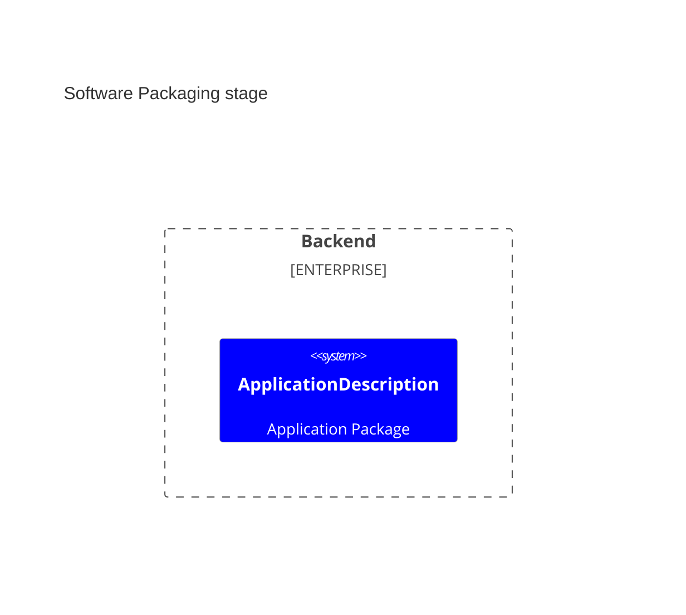
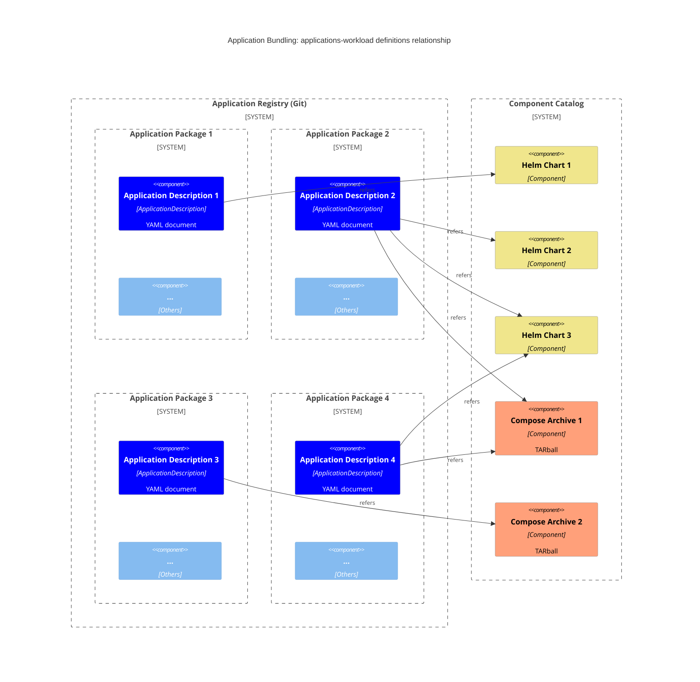
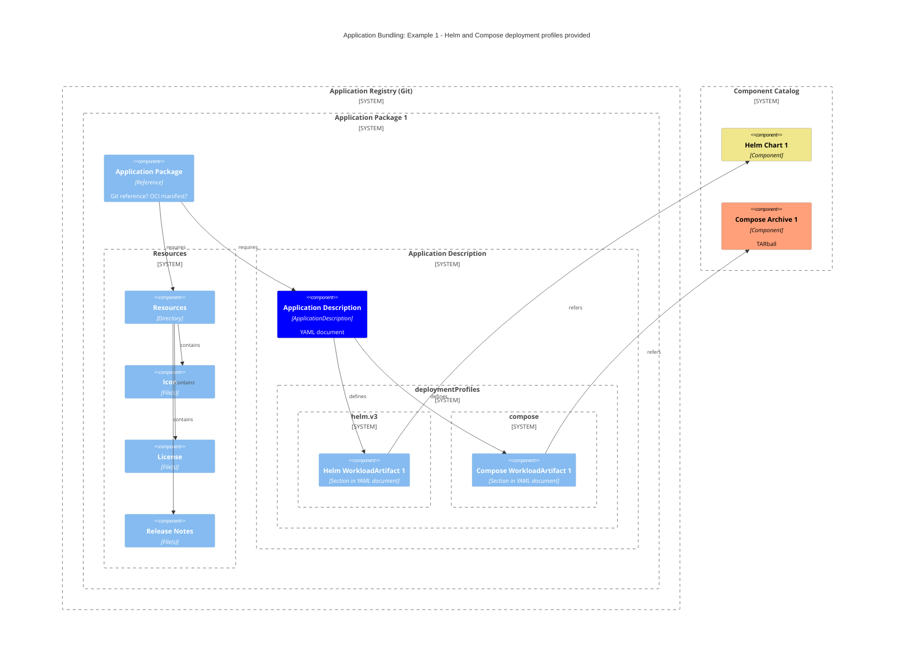
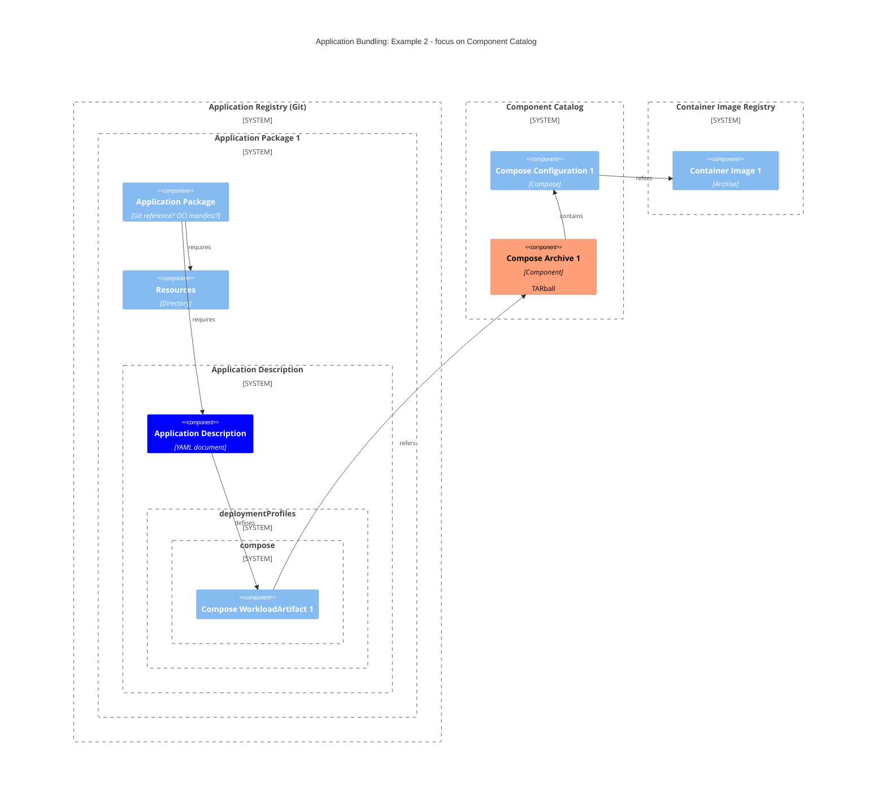
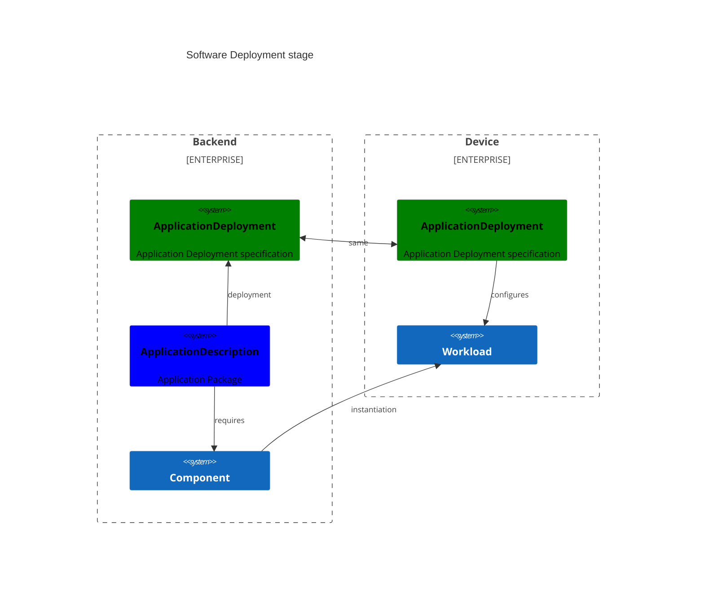
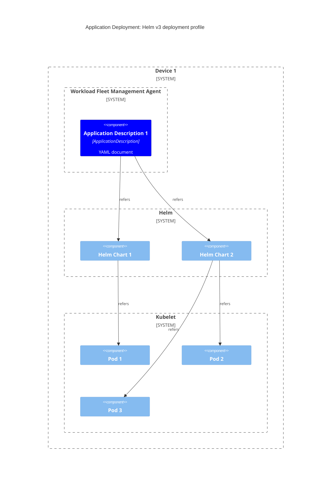

# Software Composition

[Applications][application] can be found in completely different stages:

1. "Application Packaging": application has been prepared and made ready for deployment.
2. "Application Deployment" (AKA Runtime): application has been made available and accessible on the device.

Distinguishing which stage terminology refers to is important to understand the scope of following definitions.

ℹ️ _Note_: Logically there is another intermediate stage: "Application Staging". This is the stage in which the application is set up, configured, and made available for use to the device, but has not yet been deployed (started) to be used. As of now this stage is out of scope in the Margo specification and not being considered, because some of the providers (like the Helm one) do not provide any mechanisms to manage it.

## Terminology Scoping

This section does not declare terminology, that is the task of the [Technical Lexicon](technical-lexicon.md), but rather tries to scope some of the terms to the above mentioned stages.

#### Application

The term [application][application] applies to all stages.

#### Workload

The term [Workload][workload] applies only to [running software](#2-software-deployment).

[Workloads][workload] are the result of deploying [Components][component].

#### Component

The term [Component][component] applies to the resources available in [packaged software](#1-software-packaging) that get instantiated into [Workloads][workload].

Some providers might support that multiple [Workload][workload] replicas are instantiated from a single [Component][component].

[Components][component] are made available over [Component Catalogs][component-catalog].

[Components][component] might have different shapes depending on their type and on which stage is being considered:

1. Helm v3 as [Component][component]: a [Helm Chart](https://helm.sh/docs/topics/charts/)
2. Helm v3 as [Workload][workload]: all container images required by the to-be-started pods.
3. Compose as [Component][component]: a [Compose Archive][compose-archive]
4. Compose as [Workload][workload]: a so-called [Compose file](https://github.com/compose-spec/compose-spec/blob/main/spec.md#compose-file) and all the container images required by the to-be-started [services](https://github.com/compose-spec/compose-spec/blob/main/05-services.md).

## Stages

### 1. Software Packaging

Software at rest requires following resources:

- an [Application Description][application-description]: a Margo-specific way to distribute a composition of one or more [Component][component]
- some application resources: icon, license(s), release notes,...
- some [Component][component]: a well-specified way to distribute software supported by Margo specification (e.g. Helm Chart and container images, Compose Archive,...)

[Application Descriptions][application-description], resources and [Components][component] are managed and hosted separately:

- [Application Registries][application-registry] store [Application Descriptions][application-description] and their associated application resources (as of now application registries SHALL be git repositories) 
- [Component Registries][component-registry] store components

The following diagram shows the mentioned registries and resources (container images are not shown for simplicity):

The following diagram shows the relationship between the different resources of an [Application][application] bundle and the required [Components][component] for an example application providing both Helm v3 and Compose [Deployment Profiles][deployment-profile]:

The following diagram shows the top-level structure of a Compose component:

The application and contained components are typically configurable with the option of providing default values.

### 2. Software Deployment

When a device gets the instruction to run an [Application][application] (over a desired-state specified with an [`ApplicationDeployment` object][deployment-definition]), its [Workload Fleet Management Agent][wfma] interacts with the [providers][provider-model].
That way all [Workloads][workload] needed for an [Application][application] should get started and the desired state should be reached.

In this stage the [providers][provider-model] are responsible for managing the individual [Workloads][workload].

On a Helm v3 [Deployment Profiles][deployment-profile], the [Workload Fleet Management Agent][wfma] would probably instruct the Helm API to start the individual Helm Charts.

On a Compose [Deployment Profiles][deployment-profile], the [Workload Fleet Management Agent][wfma] would probably instruct the Compose CLI to start the individual [Workloads][workload].

The following diagram shows the result of reaching the desired state for an [Application][application] with a Helm v3 [Deployment Profiles][deployment-profile] (the result of `helm install`).

The following diagram shows the result of deploying an [Application][application] and the corresponding [Components][component] with a Compose [Deployment Profiles][deployment-profile] (the result of `compose up`).

[application-description]: ../margo-api-reference/workload-api/application-package-api/application-description.md
[compose-archive]: ../app-interoperability/application-package-definition.md
[application-registry]: technical-lexicon.md#application-registry
[component]: technical-lexicon.md#component
[workload]: technical-lexicon.md#workload
[application]: technical-lexicon.md#application
[component-catalog]: technical-lexicon.md#component-catalog
[deployment-definition]: ../margo-api-reference/workload-api/desired-state-api/desired-state/?h=applicationdeployment.md#applicationdeployment-definition
[provider-model]: technical-lexicon.md/#provider-model
[wfma]: technical-lexicon/#workload-fleet-management-agent
[deployment-profile]: margo-api-reference/workload-api/application-package-api/application-description.md/#deploymentprofile-attributes
