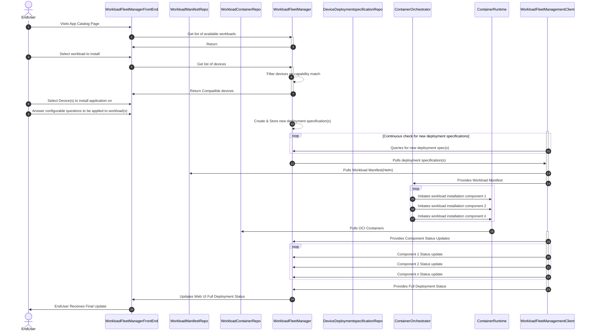

# Workload Fleet Management

Workload Management is a critical functionality that enables deployment and maintenance of workloads that are deployed to the customers edge to enable business goals. In order to achieve Margo's interoperability mission statement, the [Margo Management Interface](../margo-api-reference/margo-api-specification.md) is a critical component that enables interoperability between Workload Fleet Management Software vendors and Device Vendors. Interface hosting solutions are able to utilize the open implementation provided by the Margo community as is, or follow the specification to build their own compatible client/server components.

The main goals of the management interface are as follows:

- By hosting the server side of the interface, Workload Fleet Managers are enabled with the ability to onboard and manage workloads on all Margo compliant devices.
- Device Vendors are able to build devices that include the client side of the interface which enables workload management via all Margo compliant fleet managers.

## Workload Deployment Sequence Diagram

## Relevant Links

Please follow the subsequent links to view more technical information regarding Margo compliant devices:

- [Workload Fleet Manager Component overview](../fleet-management/workload/management-interface-requirements.md)
- [Margo API Reference](../margo-api-reference/margo-api-specification.md)
