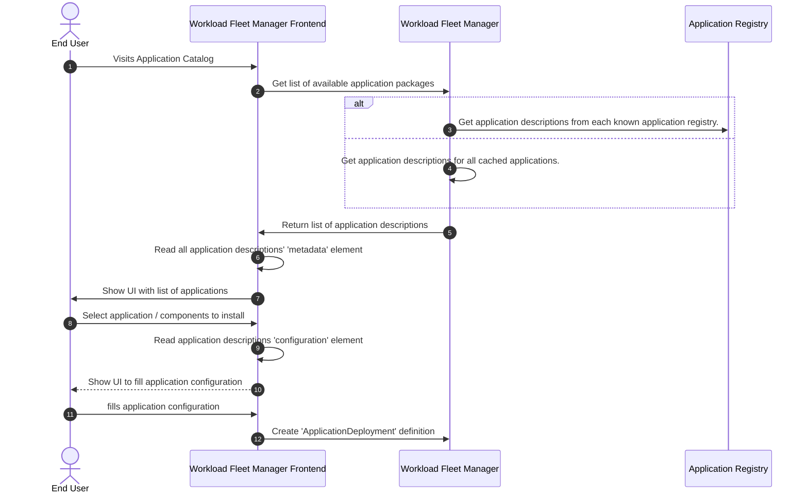

# Applications

An application is defined as an [Application Package](../concepts/applications/application-package.md) described through an [Application Description](../specification/applications/application-description.md) and consists of deployable [components](../personas-and-definitions/technical-lexicon.md#component). A running [component](../personas-and-definitions/technical-lexicon.md#component) is called a [workload](../personas-and-definitions/technical-lexicon.md#workload). A workload runs on a Margo compliant [edge compute device](../personas-and-definitions/technical-lexicon.md#edge-compute-device).

In order to help achieve Margo's interoperability [mission statement](../index.md#mission-statement) we are initially targeting [containerized](https://github.com/opencontainers) components/workloads capable of running on platforms like Kubernetes, Docker and Podman. The flexibility these platforms provide enables [workload suppliers](../personas-and-definitions/personas.md#workload-supplier) to define and package their components in a common way using [Helm](https://helm.sh/docs/) or the [Compose specification](https://github.com/compose-spec/compose-spec/blob/main/spec.md) so they can more easily be deployed to multiple compatible edge compute devices as workloads.

While Margo is initially targeting deployments using Helm or Compose, we plan to support other deployment types in the future. One of our design goals is to make it easier for [workload fleet managers](../personas-and-definitions/technical-lexicon.md#workload-fleet-manager) to support the current and future deployment types without having to implement special logic for each type. In order to achieve this, Margo defines an [application description model](../concepts/applications/application-package.md) to abstract away some of the details to make it easier for workload fleet managers to support the different deployment types.

The three main goals of Margo's application description model is to allow workload fleet managers to do the following:

- Display information about available applications (e.g., via an [application catalog](../personas-and-definitions/technical-lexicon.md#application-catalog)), which the [OT user](../personas-and-definitions/personas.md#ot-user) can deploy as workloads.
- Determine which edge compute devices are compatible with an application (regarding processor type, GPU present, RAM available, etc.)
- Capture, and validate, configuration information from the OT user when deploying application components as workloads, or updating them.

Another advantage of Margo's [application description model](../concepts/applications/application-package.md) is to enable workload suppliers to define different deployment profiles in a single application description file to target deploying to different types of edge compute devices (e.g., Arm vs. x86, Kubernetes vs. Docker) instead of needing to maintain multiple application description files.

## Packaging & Distribution

To distribute an application consisting of multiple components that are deployable as workloads, they are wrapped in an [application package](../concepts/applications/application-package.md) defined by the workload supplier who aims to provide it to Margo-compliant edge compute devices.
Therefore, the workload supplier creates an [application description YAML document](../specification/applications/application-description.md) containing information about the application and references to its components.
The application package is made available in an [application registry](../concepts/applications/application-registry.md), its components (i.e., Helm Charts or Compose Archives) are stored in a remote or [local](../concepts/applications/local-registries.md) component registry, and the linked container images are provided through a container image registry.

### Example workflow

The following diagram provides an example workflow showing one way a workload fleet manager may use the application description information:

1. An end user visits the [application catalog](../personas-and-definitions/technical-lexicon.md#application-catalog) of a Workload Fleet Manager Frontend.
2. This frontend requests all installable [application packages](../concepts/applications/application-package.md) from the Workload Fleet Manager.
3. _Either_: the Workload Fleet Manager requests all application descriptions from each known [application registry](../concepts/applications/application-registry.md).
4. _Or_: the Workload Fleet Manager maintains a cache of application descriptions and services the request from there.
5. The Workload Fleet Manager returns the retrieved application descriptions to the frontend.
6. The frontend parses the [metadata](../specification/applications/application-description.md#metadata-attributes) element of all received application descriptions.
7. The frontend presents the parsed metadata in a UI to the end user.
8. The end user selects the application package to be installed.
9. The frontend parses the [configuration](../specification/applications/application-description.md#configuration-attributes) element of the selected application description.
10. The frontend presents the parsed configuration to the user.
11. The end user fills out the [configurable application parameters](../specification/applications/application-description.md#defining-configurable-application-parameters).
12. The frontend creates an `ApplicationDeployment` definition (from the `ApplicationDescription` and the filled out parameters) and sends it to the Workload Fleet Manager, which executes it as the [desired state](../specification/margo-management-interface/desired-state.md).

## Relevant Links

Please follow the subsequent links to view more technical information regarding Margo application packaging:

- [Application Package](../concepts/applications/application-package.md)
- [Application Registry](../concepts/applications/application-registry.md)