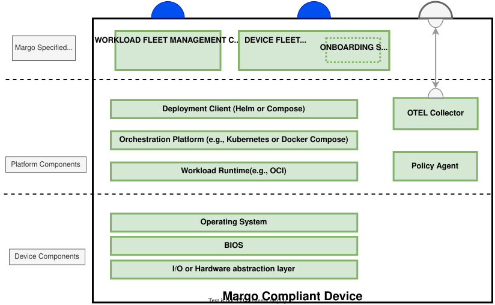

# Edge Compute Devices

Within Margo, devices are represented by compute hardware that is present within the customer's environment. These devices are a crucial piece of the Margo ecosystem: they let workloads run locally within the industrial environment, close to the local devices, databases, and other critical control system entities they interact with. Running compute at the edge keeps latency low, keeps operations resilient when connectivity is intermittent, and keeps sensitive data on-site.

The Margo specification provides device vendors the following benefits:

- By producing a Margo compliant device it is compatible with ALL Margo compliant workload fleet managers
- Device vendors have freedom of choice regarding the specific components, like supported manifests, container orchestration platforms, and workload runtimes.
- Support for gateway devices is also present in the specification. This allows devices to be represented by a parent device, have workloads assigned to them, without having to host the management client.

## Margo Device layers

Margo devices consist of three major layers: Margo interface layer, platform layer, and traditional device layer. Although Margo requires compliance towards its requirements, such as hosting the Margo management interface client, the device vendor has freedom to implement as they see fit.

Below is a diagram that depicts the device layers along with some examples:

## Relevant Links

Please follow the subsequent links to view more technical information regarding Margo compliant devices:

- [Device Concepts](../concepts/edge-compute-devices/devices.md)
- [Gateway Devices](../concepts/gateways/gateways.md)
- [Collecting Application Observability Data](../specification/observability/collecting-workload-observability-data.md)
