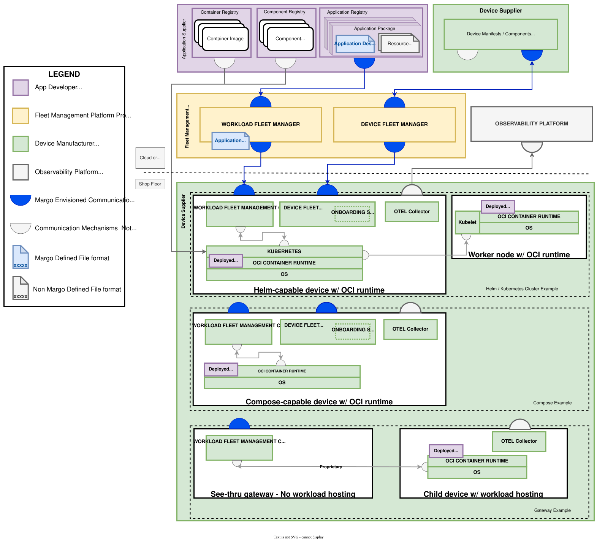

# Envisioned System Design

Margo intends to create an open [interoperability](../personas-and-definitions/technical-lexicon.md#interoperability) standard and ecosystem for the industrial edge, allowing [edge compute devices](../personas-and-definitions/technical-lexicon.md#edge-compute-device), [workloads](../personas-and-definitions/technical-lexicon.md#workload), and [fleet management](../personas-and-definitions/technical-lexicon.md#fleet-management) software to be compatible and interoperable across manufacturers and software developers willing to adopt such standard.

## Overview

The envisioned system can be broken down into the following main components:

### Workloads

Workloads are the software deployed to Margo-compliant Target Compute.
They are deployed [Components](../personas-and-definitions/technical-lexicon.md#component) of an [Application Package](../personas-and-definitions/technical-lexicon.md#application-package).
See the [Applications overview](applications) page to learn more Margo's supported workloads and how they are packaged.

### Workload Observability

For distributed systems its vitally important to collect diagnostics information about the workloads and systems running within the environment. See the [workload observability overview](./workload-observability.md) page to see how Margo is making use of the Open Telemetry specification to capture this information.

### Workload Fleet Management

Workload fleet management software is the centralized software solution for managing the lifecycle of workloads on Margo compliant Target Compute. See the [workload fleet management](./workload-fleet-management.md) page to learn more more.  

### Target Compute

Target Compute is the compute surface workloads are deployed to and run on. It is provided by edge compute devices, clusters, or gateway services, and as part of the Margo initiative we are very prescriptive about how these must be configured to be Margo compliant. See the [Target Compute overview](./edge-compute-devices.md) page to learn more.

