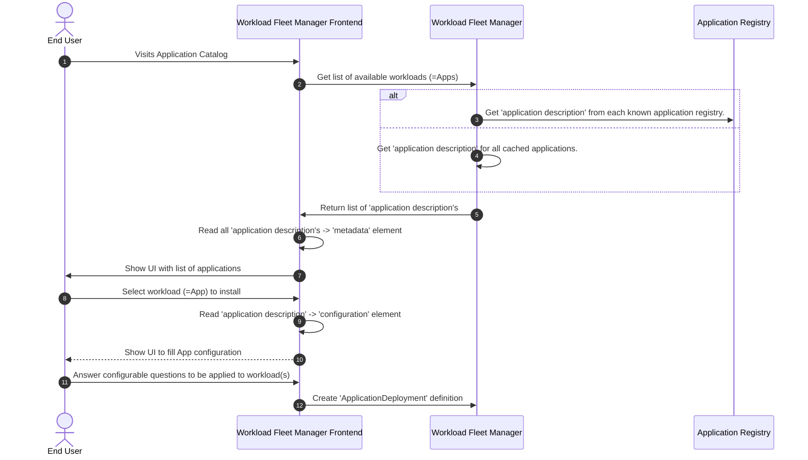

# Workloads

A [workload](../personas-and-definitions/technical-lexicon.md#workload) is software deployed to, and run on, Margo compliant [edge compute devices](../personas-and-definitions/technical-lexicon.md#edge-compute-device).

In order to help achieve Margo's interoperability [mission statement](../index.md#mission-statement) we are initially targeting [containerized](https://github.com/opencontainers) workloads capable of running on platforms like Kubernetes, Docker and Podman. The flexibility these platforms provide enables [workload suppliers](../personas-and-definitions/personas.md#workload-supplier) to define and package their workloads in a common way using [Helm](https://helm.sh/docs/) or the [Compose specification](https://github.com/compose-spec/compose-spec/blob/main/spec.md) so they can more easily be deployed to multiple compatible edge compute devices.

While Margo is initially targeting deployments using Helm or Compose, we plan to support other deployment types in the future. One of our design goals is to make it easier for [workload fleet managers](../personas-and-definitions/technical-lexicon.md#workload-fleet-manager) to support the current and future deployment types without having to implement special logic for each type. In order to achieve this, Margo defines an [application description model](../concepts/workloads/application-package.md) to abstract away some of the details to make it easier for workload fleet managers to support the different deployment types.

The three main goals of Margo's application description model is to allow workload fleet managers to do the following:

- Display information about the workloads the [OT user](../personas-and-definitions/personas.md#ot-user) can deploy (e.g., a [workload catalog](../personas-and-definitions/technical-lexicon.md#application-catalog)).
- Determine which edge compute devices are compatible with the workloads (e.g., processor types match, GPU present, etc.)
- Capture, and validate, configuration information from the OT user when deploying and updating workloads.

Another advantage of Margo's [application description model](../concepts/workloads/application-package.md) is to enable workload suppliers to define different deployment profiles in a single application description file to target deploying to different types of edge compute devices (e.g., Arm vs. x86, Kubernetes vs. Docker) instead of needing to maintain multiple application description files.

## Packaging

To distribute one, or more, workloads they are wrapped in an [application package](../concepts/workloads/application-package.md) that is provided by the workload supplier who aims to provide it to Margo-compliant edge compute devices. Therefore, the workload supplier creates an application description YAML document containing information about the application and a reference on how to deploy the [OCI-containerized](https://github.com/opencontainers) workloads that make up the application. The application package is made available in an [application registry](../concepts/workloads/application-registry.md) and the OCI artifacts are stored in a remote or [local registry](../concepts/workloads/local-registries.md).

## Example workflow

The following diagram provides an example workflow showing one way a workload fleet manager might use the application description information:

1. An end user visits an [workload catalog](../personas-and-definitions/technical-lexicon.md#application-catalog) of the Workload Fleet Manager Frontend.
2. This frontend requests all workloads from the Workload Fleet Manager.
3. _Either_: the Workload Fleet Manager requests all application descriptions from each known  Application Registry.
4. _Or_: the Workload Fleet Manager maintains a cache of application descriptions and services the request from there.
5. The Workload Fleet Manager returns the retrieved documents of application descriptions to the frontend.
6. The frontend parses the [metadata](../specification/application-package/application-description.md#metadata-attributes) element of all received application description documents.
7. The frontend presents the parsed metadata in a UI to the end user.
8. The end user selects the workload to be installed.
9. The frontend parses the [configuration](../specification/application-package/application-description.md#configuration-attributes) element of the selected application description.
10. The frontend presents the parsed configuration to the user.
11. The end user fills out the [configurable application parameters](../specification/application-package/application-description.md#defining-configurable-application-parameters) to be applied to the workload.
12. The frontend creates an `ApplicationDeployment` definition (from the `ApplicationDescription` and the filled out parameters) and sends it to the Workload Fleet Manager, which executes it as the [desired state](../specification/margo-management-interface/desired-state.md).

## Relevant Links

Please follow the subsequent links to view more technical information regarding Margo application packaging:

- [Application Package](../concepts/workloads/application-package.md)
- [Application Registry](../concepts/workloads/application-registry.md)
